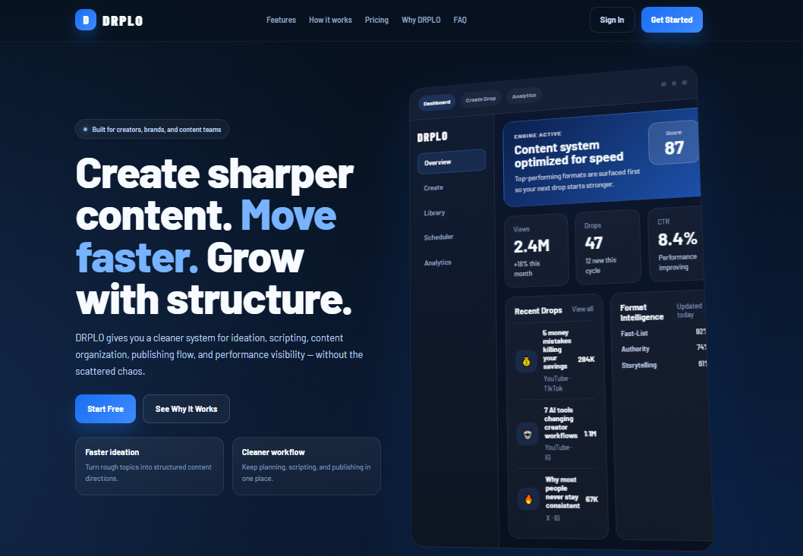
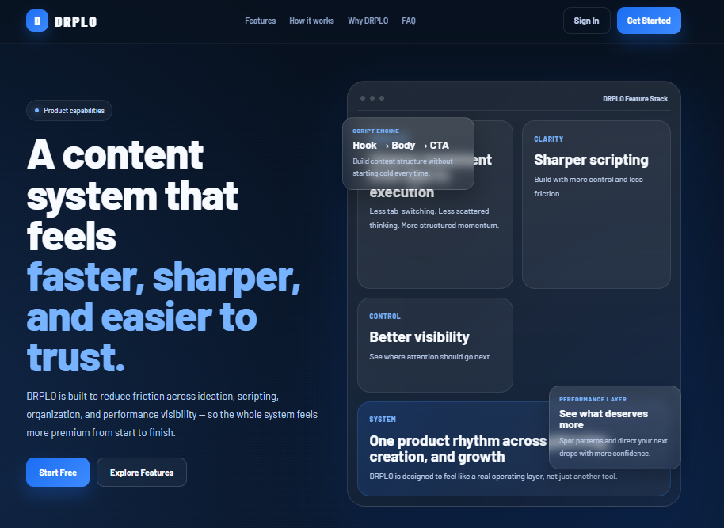
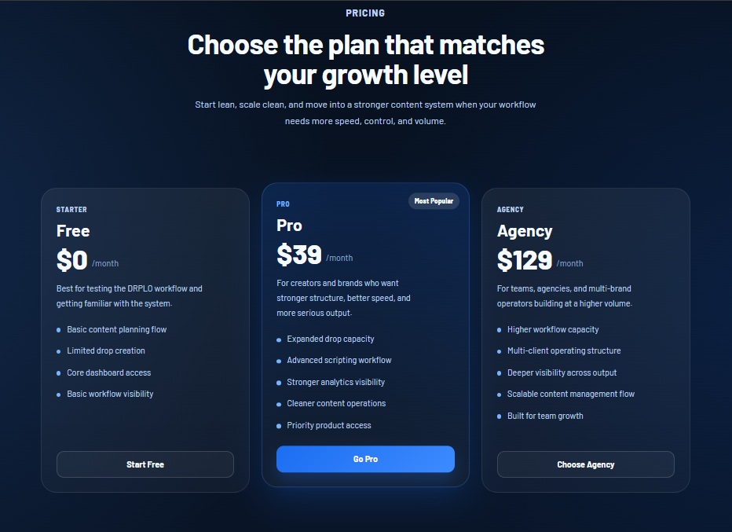
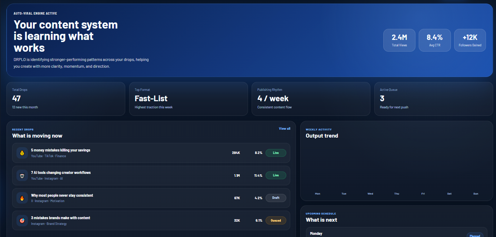
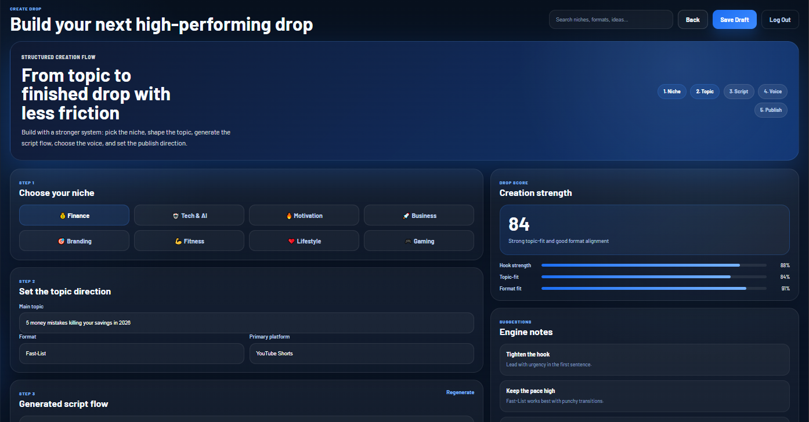
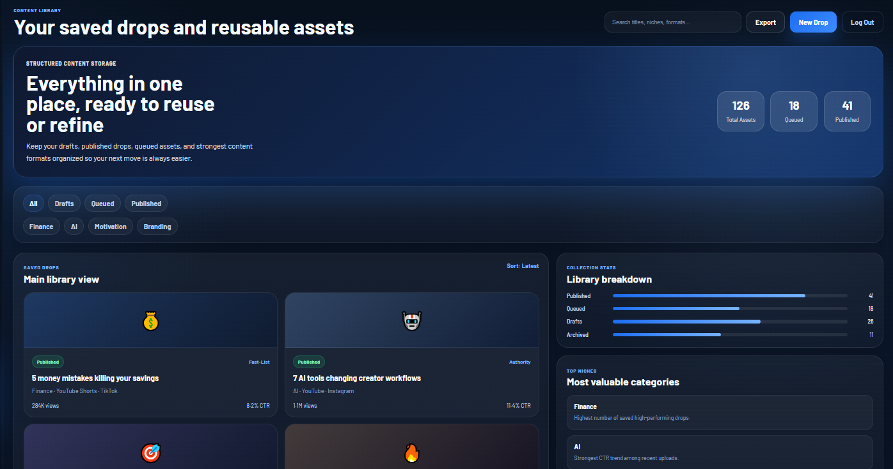
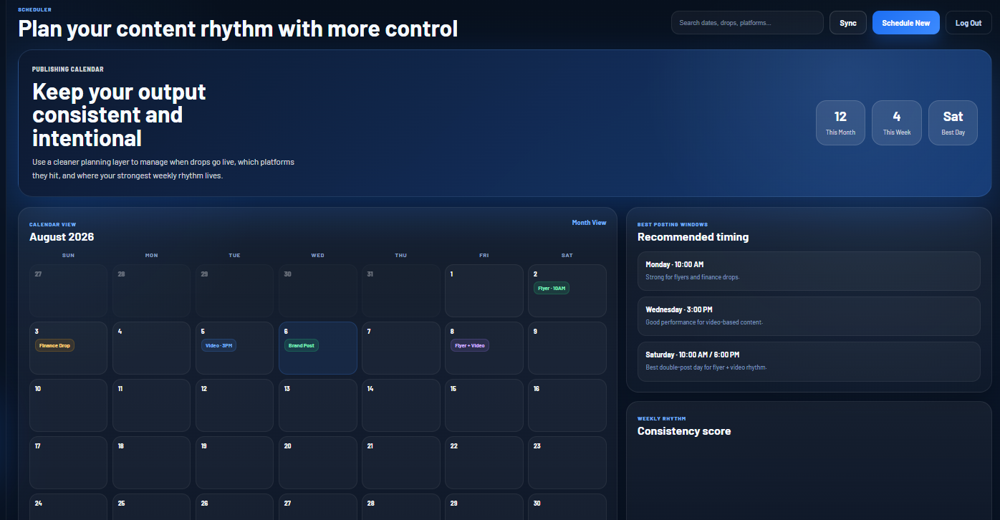
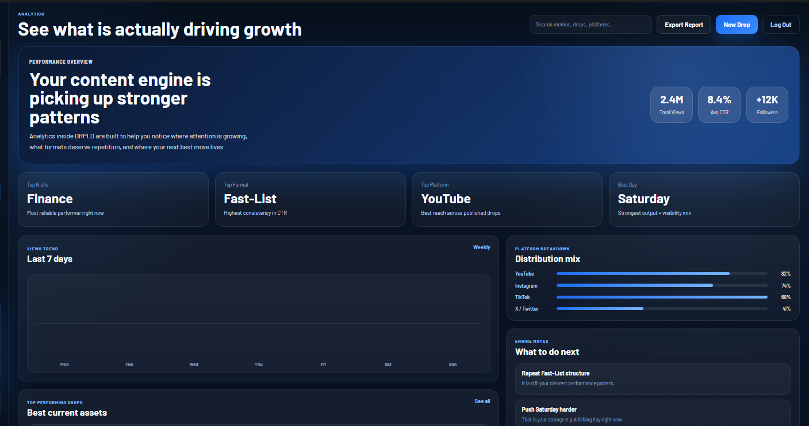
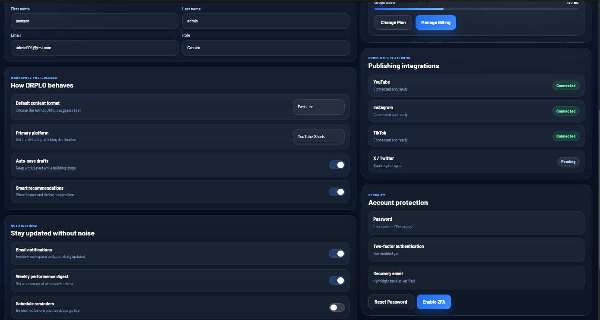

# DRPLO — Content Operating System

  A premium SaaS-style content workflow system for creators, brands, and agencies.

  <a href="https://your-netlify-link.netlify.app">Live Demo</a>
  ·
  <a href="https://github.com/your-username/your-repo-name">Repository</a>

---

## Preview

DRPLO is a structured content creation and management system designed to turn scattered ideas into a cleaner, more intentional workflow.

It brings together:

* planning
* scripting
* content organization
* scheduling
* performance visibility

into one premium frontend experience.

---

## Product Vision

Most content systems break when output starts increasing.

Ideas end up in one place, drafts somewhere else, scheduling becomes inconsistent, and performance insight arrives too late to be useful.

DRPLO is built around a different direction:

* clearer structure
* stronger workflow rhythm
* better visibility
* more confidence moving faster

---

## Key Screens

### Homepage

A premium SaaS landing page built to position DRPLO like a real product.

### Features

A deeper product story showing how DRPLO reduces friction across the content workflow.

### Pricing

A pricing system designed to make the product feel commercially real and scalable.

### Dashboard

A full app-style dashboard showing metrics, recent drops, performance signals, and quick actions.

### Create Drop

A structured creation flow for moving from niche selection to publishing setup.

### Content Library

A centralized place for drafts, queued drops, published assets, and reusable content.

### Scheduler

A calendar-driven planning system for organizing content release rhythm.

### Analytics

A performance view built to highlight what is actually driving growth.

### Settings

A complete control layer for profile, workspace preferences, billing simulation, and integrations.

---

## Core Features

### Structured Content Workflow

Move from idea to execution with a more deliberate flow.

### Premium SaaS UI

Modern layout system with:

* strong typography
* layered panels
* gradients
* product-style hierarchy

### Multi-Page Marketing Site

Includes:

* Home
* Features
* Pricing
* About
* Contact
* Auth pages
* 404 page

### Full App Prototype

Includes:

* Dashboard
* Create Drop
* Content Library
* Scheduler
* Analytics
* Settings

### Demo Authentication Flow

Frontend-only simulated auth powered by local storage for a more realistic product feel.

---

## Tech Stack

DRPLO was built with a simple, direct frontend stack:

* **HTML5**
* **CSS3**
* **Vanilla JavaScript**
* **LocalStorage** for demo auth state

No frameworks were used.

The focus was on:

* UI/UX quality
* product structure
* frontend architecture
* realism of flow

---

## Project Structure

 bash
.
├── index.html
├── features.html
├── pricing.html
├── about.html
├── contact.html
├── signin.html
├── signup.html
├── forgot-password.html
├── auth-placeholder.html
├── dashboard.html
├── create-drop.html
├── content-library.html
├── scheduler.html
├── analytics.html
├── settings.html
├── 404.html
├── style.css
├── main.js
└── assets/
 

---

## Design Direction

The design approach was intentionally product-first.

This project was built to feel:

* premium
* modern
* structured
* believable as a real SaaS

Instead of just building pages, the goal was to build a **cohesive product experience**.

---

## Current State

This project is currently a **frontend SaaS prototype**.

### Included

* complete UI system
* connected page navigation
* realistic app structure
* demo auth behavior
* responsive layout foundation

### Not Yet Included

* real backend
* real database
* OAuth authentication
* real analytics engine
* live publishing integrations
* real form submission handling

---

## Future Improvements

Planned next steps include:

* backend integration
* real authentication
* database-backed content storage
* live scheduling logic
* analytics persistence
* platform integrations
* team / agency workspace support

---

## Running Locally

Clone the project and open `index.html` in your browser.

 bash
git clone https://github.com/manlikehybrid/DRPLO.git
 

Then open the folder in Visual Studio Code and launch with Live Server or open the HTML files directly.

---

## Live Demo

Add your deployed Netlify link here:

**Demo:** https://drplo.netlify.app

---

## Screenshots Setup

Create a folder like this:

 bash
assets/
└── screenshots/
 

Then add screenshots with names like:

* `homepage-preview.png`
* `homepage.png`
* `features.png`
* `pricing.png`
* `dashboard.png`
* `create-drop.png`
* `content-library.png`
* `scheduler.png`
* `analytics.png`
* `settings.png`

GitHub will automatically display them inside the README.

---

## Author

**Built by HybridGfx**

* GitHub: https://github.com/manlikehybrid

---

## License

This project is currently intended for portfolio and demonstration purposes.
